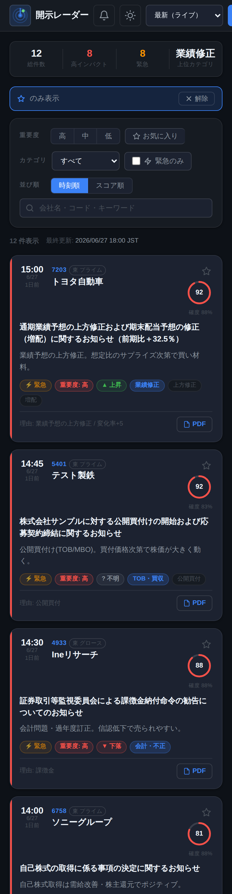

# 開示レーダー — TDnet 適時開示モニター

日本株の **適時開示(TDnet)** を準リアルタイムで取得し、株価に効きそうな開示だけを
重要度スコア付きで抽出して、**スマホから閲覧**できるダッシュボード。
完全無料・PC常駐不要(GitHub Actions + GitHub Pages)で運用できます。

<p align="center">
  
</p>

```
┌───────────────┐   cron   ┌──────────────────────────────┐   commit   ┌──────────────┐
│ GitHub Actions │ ───────▶ │ fetch → analyze → store(JSON) │ ─────────▶ │ docs/data/   │
│  (無料・常駐不要) │          │  src/fetcher  src/analyzer    │            │ disclosures  │
└───────────────┘          └──────────────────────────────┘            └──────┬───────┘
                                                                                │ read
                                                                       ┌────────▼────────┐
                                                                       │ GitHub Pages(UI) │
                                                                       │  開示レーダー(docs/) │
                                                                       └─────────────────┘
```

## 特長
- **無料データソース**: yanoshin TDnet WebAPI(+ release.tdnet.info スクレイピング fallback)。
- **重要度トリアージ**: ルールベースで「業績修正/配当/自社株買い/TOB/増資/特損/上場廃止…」等を
  分類し 0-100 のスコアと方向(positive/negative/neutral)、`urgent`(瞬間的に動かしうるか)を判定。
  役員人事・定款変更・進捗報告などの定例開示は自動で減衰。
- **任意でLLM精査**: スコアがしきい値以上の開示だけ無料LLM(Gemini/Groq 等)で要約・再評価。
  鍵ゼロでもルールベースで動作。
- **商業品質のWeb UI**: ライト/ダークテーマ、本日のサマリー統計、相対時刻＋新着、
  ウォッチリスト(お気に入り銘柄)、銘柄フィルタ、ブラウザ通知、スケルトン等(ビルド不要)。
- **過去に遡って閲覧**: 日付別アーカイブ(`docs/data/archive/`)＋UIの日付セレクタ。バックフィルで過去分も蓄積可能。
- **決算要約**: 決算短信PDFを解析し、売上/営業益/経常/純益と前年比・配当・業績予想を要約表示(LLM設定時はコメント付き)。
- **確信度・タグ・訂正判定**: 各開示にルール確信度(0-100)・細かなタグ・訂正/続報フラグを付与。
- **Discord通知(後段)**: `urgent` な新着を Webhook 通知する配線済み。既定は無効。

## ディレクトリ
```
src/fetcher/    TDnet取得(yanoshin API + スクレイピング fallback)
src/analyzer/   重要度分析(rules.py ルールエンジン / llm.py LLM抽象化 / earnings.py 決算要約)
src/store/      保存・重複排除(jsonstore=ライブ / archive=日付別アーカイブ)
src/notify/     Discord通知(後段)
src/main.py     エントリポイント(取得→分析→決算要約→保存→アーカイブ→通知)
src/backfill.py 過去の開示をさかのぼってアーカイブに蓄積
docs/           GitHub Pages 用 Web UI(index.html / app.js / style.css)
docs/data/      Web UI が読む生成データ(Actions が更新)
.github/workflows/poll.yml   定期実行ワークフロー
SCHEMA.md       モジュール間のデータ契約
```

## ローカルで試す
```bash
pip install -r requirements.txt
python -m src.main --limit 50          # 取得→分析→docs/data/disclosures.json 更新
# UIをローカル表示
cd docs && python -m http.server 8000  # http://localhost:8000
pytest -q                              # ルール/保存ロジックのテスト
```
> ネットワーク制限環境では取得0件になることがあります(その場合もクラッシュせず空動作)。

## デプロイ(無料・PC不要)
1. このブランチを **main にマージ**(scheduleはデフォルトブランチの `poll.yml` のみ有効)。
2. **GitHub Pages** を有効化: Settings → Pages → Source = `Deploy from a branch`,
   Branch = `main` / フォルダ = `/docs`。発行URLをスマホのホーム画面に追加すると便利。
3. **Actions** が **5分間隔**(平日 JST 08:00-19:00 目安)で自動実行し、データを更新・コミット。
   - **public** リポジトリは Actions 無制限無料(本構成は public 前提)。
   - private に戻す場合は無料枠 **2000分/月**のため `poll.yml` の `cron` 間隔を広げること。

### LLM精査を有効化(任意・無料枠推奨)
GitHub の Settings → Secrets and variables → Actions で設定:
- Variables: `LLM_PROVIDER=gemini`(または groq/openai/claude)、`LLM_MIN_SCORE`(既定50)、
  `MIN_SCORE`(既定30。これ未満の定例開示は無視。0で全件保持)
- Secrets: `GEMINI_API_KEY`(無料鍵: https://aistudio.google.com/app/apikey )など

> 既定で `MIN_SCORE=30` 未満(役員人事・定款変更・進捗報告など)は保存・表示せず、
> 株価に効きそうな開示だけを残します。スマホでは Web を開いて「ホーム画面に追加」すると
> PWA としてアプリのように起動できます(`manifest.webmanifest`)。

ローカルは `.env`(`.env.example` を参照)で同様に設定できます。

### 過去データのバックフィル(過去に遡る)
- **自動**: 当日分は毎回のポーリングでアーカイブに蓄積。さらに **backfill-archive ワークフローが
  毎日 JST 20:00 に直近7日を自動バックフィル**するので、通常は手動操作は不要(穴も自動で埋まる)。
- **手動(深い過去を一度だけ入れたい時)**: Actions → **backfill-archive** → Run workflow →
  `days`(例: 90) を指定。または UI フッターの「⏪ 過去データを追加取得」リンクからその画面を開ける。
  ローカルなら `python -m src.backfill --days 90`(決算PDFも解析するなら `--earnings`)。
- 生成物 `docs/data/archive/YYYY-MM-DD.json` と `index.json` が UI の日付セレクタに反映される。

### 決算要約について
`決算`カテゴリの開示はPDFを解析して主要数値(売上/営業益/経常/純益と前年比)を抽出・表示します。
- LLM未設定でも正規表現で主要数値を抽出(`source: regex`)。
- `LLM_PROVIDER`(Gemini等)設定時は、より正確な数値整形と所感コメント付き(`source: llm`)。
- 1回の実行で解析する決算は `EARNINGS_PER_RUN`(既定8)件まで。`EARNINGS_ENABLED=0` で無効化。

### Discord通知(後段)
Secrets に `DISCORD_WEBHOOK_URL` を設定すると、`urgent` な新着開示が自動通知されます。

## 重要度スコアの考え方(`src/analyzer/rules.py`)
| 例 | カテゴリ | 目安スコア |
|---|---|---|
| 公開買付け(TOB/MBO) | TOB・買収 | 92 |
| 業績予想の上方/下方修正 | 業績修正 | 84+ |
| 第三者割当/MSワラント | 増資・希薄化 | 82 |
| 自己株式の取得 | 自社株買い | 78 |
| 特別損失/減損 | 特損・減損 | 75 |
| 決算短信 | 決算 | 〜58 |
| 役員人事/定款変更/進捗報告 | その他 | 低(減衰) |

`urgent` = 高インパクト かつ 瞬間的に動きやすいカテゴリ かつ 方向が明確、のとき真。

## ロードマップ
- [x] リアルタイム取得 + ルールベース重要度分析 + スマホWeb UI
- [x] 無料LLMによる要約・再評価(任意)
- [x] 過去に遡って閲覧(日付別アーカイブ + バックフィル)
- [x] 決算短信PDFの解析・決算要約の表示
- [ ] Discord 通知の本番運用(Webhook設定で有効化)
- [ ] 決算の「サプライズ」評価(コンセンサス比)
- [ ] より高頻度な取得(Cloudflare Workers 等への移行オプション)

詳細なデータ仕様は [SCHEMA.md](./SCHEMA.md) を参照。
